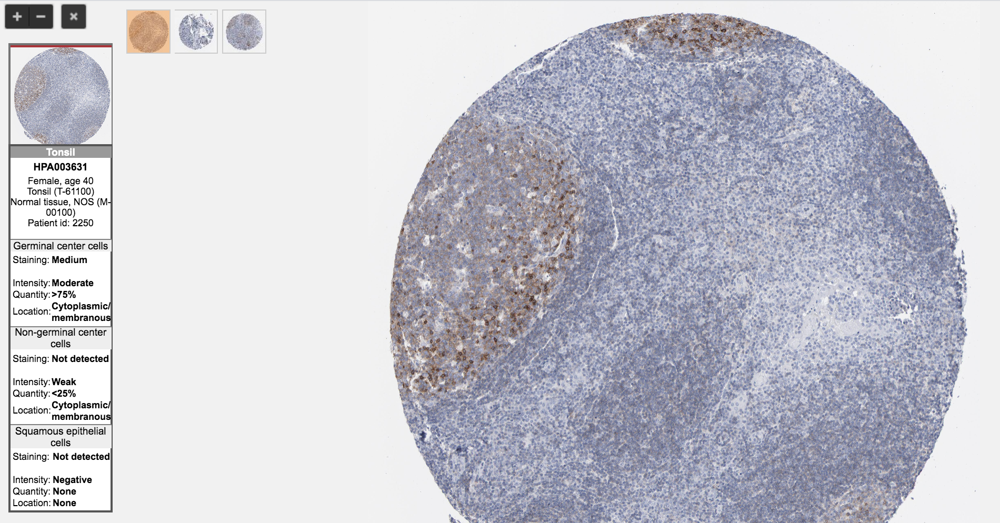

Publicly available gene expression databases
================
Erick Lu

March 17, 2020

-   [Gene expression databases](#gene-expression-databases)
    -   [biogps.org](#biogps.org)
    -   [gtexportal.org](#gtexportal.org)
    -   [proteinatlas.org](#proteinatlas.org)
    -   [immgen.org](#immgen.org)
    -   [Single-cell gene expression databases](#single-cell-gene-expression-databases)
        -   [EBI Single Cell Expression Atlas](#ebi-single-cell-expression-atlas)
        -   [BROAD Single Cell Portal](#broad-single-cell-portal)
-   [Human tumor expression databases](#human-tumor-expression-databases)
    -   [firebrowse.org](#firebrowse.org)
    -   [oncolnc.org](#oncolnc.org)
    -   [Gepia2](#gepia2)
    -   [PROGGENE](#proggene)
    -   [Downloading TCGA data](#downloading-tcga-data)
-   [Conclusion](#conclusion)

Gene expression databases
=========================

When learning about a gene for the first time, we usually start off by asking questions about its expression pattern, such as:

-   What tissues in the body express the gene?
-   Within these tissues, which cell types express the gene?
-   Is expression of this gene correlated with disease burden or survival?

This type of information has many uses, from determining cell type-specific gene signatures to assessing whether drugs that target a specific protein will have undesirable off-target effects. Luckily, several publicly available databases can be used to determine the overall expression pattern of a gene of interest. In this guide, I will describe how to use the databses that I have found most useful.

biogps.org
----------

For human tissue-level and cell type expression, <http://biogps.org/> is a great place to start. Entering the name of your gene in the search box should show results for the different species available within biopgps. As an example, I search for P2RY8, a G-protein coupled receptor that I studied in my PhD.

This provides a nice overview of the cell types that have expression of your gene of interest. We observe that P2RY8 is expressed in many different immune cell types, including B cells, T cells, and NK cells. It appears to have low expression in stromal cells such as fibroblasts and epithelial cells.

We are currently looking at data from the `Primary Cell Atlas` dataset. Biogps has several different datasets to choose from. We can change the dataset by clicking on the `change dataset` button in the top right of the center panel:

This other dataset, `Barcode on normal tissues`, displays expression of your gene across a set of tissues and sorted cell types. This is useful for determining which tissues one might use as a positive expression control for assays such as qPCR or IHC.

We observe that spleen, bone marrow, and tonsil have high expression of P2RY8, and may be good sources for positive expression control tissues.

gtexportal.org
--------------

Another database that gives tissue-level expression is the gTEX Portal: <https://gtexportal.org/home/>. Simply type in the name of the gene and a plot will show up showing overall expression of the gene in various whole tissue / organs:

Using this website in conjunction with Biogps allows us to be more confident in assessing the expression pattern of our gene in tissues.

proteinatlas.org
----------------

The Human Protein Atlas (<https://www.proteinatlas.org/>) is an immunohistochemistry database which displays the expression of a protein in both healthy tissues as well as tumor-bearing tissues. In addition to showing the relative expression of the protein across different tissues in the body, clicking on a tissue type will display the raw immunohistochemistry (IHC) images, so that you can observe the spatial expression pattern of your protein as well as assess whether the staining looks on-target. This tool is great for validating results from the gene expression databases. We would expect that the tissues with high gene expression should also have high expression at the protein level. As an example, I search for P2RY8 below:

We can examine the raw IHC images by clicking on the `Tissue` tab. Within this tab, you can click through the tissues to observe what the staining looks like. As an example, here are the staining results in tonsil tissue:

We observe that the majority of the staining lies in the germinal centers of the tonsil, suggesting that these sites contain cells that have high expression of P2RY8. This makes sense based on the gene expression data from Biogps and gTEX.

This website also has a cancer cell line database, in which 64 cancer cell lines originating from various tissues have been characterized by RNA-seq. It categorizes the cell lines based on tissue of origin and allows you to search for the expression level of your gene of interest. For example, I find that P2RY8 is expressed by cell lines of hematopoietic origin.

This is useful when you are interested in using cell line models for your project, and need to select a line that is positive or negative for your gene of interest. The raw RNA-seq data for the cell lines can also be downloaded from: <https://www.proteinatlas.org/about/download>.

immgen.org
----------

<http://www.immgen.org/> is a great database for exploring expression of genes in mouse immune cell subsets. Clicking on the `Data Browsers` button will show you the tools available. I typically use the first tool, `Gene Skyline`. Here, immune cell subsets were isolated using FACS and their gene expression profiles were assessed using either RNA-seq or microarray. Searching for your gene of interest in the microarray database shows the relative expression level of the gene across all the individual populations. Since there is no mouse orthologue for P2RY8, I will search instead for Gpr183, another G-protein coupled receptor I worked on before:

The RNA-seq portal provides similar data, but on more cell types. RNA-seq is typically a more robust method of assessing gene expression, but I would recommend searching your gene on both portals to see if the results match.

Another nice thing about this website is that clicking on the cell subset will display the flow cytometry gating strategy and purity. For example, clicking on the "DC.8+.Sp" subset will open a PDF that displays how the cells were stained and gated:

Another useful tool on the website is `MyGeneset`. This tool allows you to plug in a gene signature of interest and see which cell types express the highest amounts of each gene in the set:

In the example above, I input a set of genes specific to various different cell types. We can see that CD3e expression is restricted to T cells, CD19 expression is restricted to B cells, and Xcr1 expression is restricted to CD8+ dendritic cells, as expected. If you ever have a set of multiple genes that you want to quickly determine the expression pattern for, this is a great tool.

Single-cell gene expression databases
-------------------------------------

Single-cell RNA-seq is useful for determining the expression of a gene within heterogenous mixtures of cells. This is particularly useful for determining cell-type specific gene signatures. The cell populations in these datasets are defined by their gene expression patterns, rather than other databases which pre-define cell types using flow-cytometry panels and FACS. With single-cell RNA-seq, there is a lower possibility of contaminating cells biasing the true gene expression pattern of a cell type of interest. There are a couple of good single-cell RNA-seq databases, which I will describe below.

### EBI Single Cell Expression Atlas

The Single Cell Expression Atlas at the EBI (<https://www.ebi.ac.uk/gxa/sc/home>) contains a repository of both mouse and human single-cell RNA-seq datasets. Searching the database takes some time, so instead of inputting the gene in the search bar, I browse through the various single-cell experiments until I find a dataset containing the cells that I am interested in profiling.

Clicking on `Browse Experiments` should also show you a list of the individual single-cell RNA-sequencing datasets available. Scrolling through the experiments, I find the dataset "Immune landscape of viral- and carcinogen-derived head and neck cancer", to be interesting. Below, I search that dataset for the presence of B cells by searching for the gene CD19:

The plot on the left is a t-SNE plot showing the various cell clusters, presumably generated using the R package Seurat. To the right is a gene overlay plot, which shows which of the cells in the t-SNE plot have positive expression of your gene (also called a `FeaturePlot` in Seurat). There appears to be a large cluster of CD19-positive cells which are likely B or Plasma cells on the left, which has a cluster designation of "Cluster 3". I can now further explore what other genes are associated with that cluster by clicking the "Marker Genes" tab on the left side.

These results show the top 5 markers that are enriched in each of the clusters defined in the t-SNE plot from the previous tab, and are likely generated based on the `FindAllMarkers` function in Seurat.

### BROAD Single Cell Portal

A similar website is the Single Cell portal at the BROAD institute (<https://singlecell.broadinstitute.org/single_cell>), which also contains a repository of publicly available single-cell RNA-sequencing datasets. Clicking on the "Search Gene" tab and searching for your gene will show its expression across pre-defined cell subsets within each of the single-cell RNA-seq experiments, displayed as violin plots:

Clicking on the dataset will again show the details, but this time the data seem to have been analyzed using a different software (likely in Python). However, the functionality is the same. A scatterplot showing the cell clustering is displayed, and searching for the gene will overlay the expression values ontop of this plot. You can choose between the violin plot or scatterplot output by clicking on the respective tabs.

You can also get a summary of the experimental set-up by clicking on the "Summary" tab.

These two single-cell RNA-seq databases are great to use in conjunction with the other bulk RNA-sequencing databases. They allow you to examine expression in unknown cell types that were not present in the other databases. It is also good to cross-reference the gene expression patterns for cell types that exist in both types of databases.

------------------------------------------------------------------------

Human tumor expression databases
================================

Gene expression within tumors is a hot topic. We are often interested in finding genes that are highly enriched in tumors compared to normal tissue, with the hopes that targeting such a gene will allow us to selectively target tumors and leave normal tissues in the body intact. We are also interested in how expression levels of a protein within tumors correlate with patient survival. If there is a strong negative or positive correlation with survival, there is a greater likelihood that some underlying biology is driving the split.

These types of gene expression assessments can be made using data from The Cancer Genome Atlas (TCGA). There are multiple websites out there that have tools for analyzing gene expression patterns and survival associations using TCGA data. Below some that I have found useful.

firebrowse.org
--------------

<http://firebrowse.org/> is a webpage created by the BROAD Institute that allows users to view the expression level of a gene of interest across all the indications within TCGA. For example, if I am interested in GPR183, I would input this into the search bar and the following result will be displayed:

As we can see, each cancer indication is listed on the x-axis, and the expression of the gene is listed on the y-axis. For each indication, the expression of the gene within the tumor tissue samples (red) as well as the expression within the adjacent normal tissue samples (blue) are plotted. The indications are by default alphabetically sorted, but we can also sort the indications based on expression level. This is a useful way to quickly identify indications that have high expression of your gene, as well as identify indications in which the gene is enriched in tumor tissue compared to the adjacent normal tissue. From the plot above, we observe that GPR183 is enriched in tumor tissue in kidney renal clear cell carcinoma (KIRC).

oncolnc.org
-----------

In order to assess survival associations with gene expression, a Cox regression for survival analysis as well as a Kaplan Meier survival analysis can be performed. This requires matching each tumor within TCGA with its corresponding clinical data, which is tedious due to the messy nature of the data. Luckily, a webtool is available that will perform these calculations for us, at <http://www.oncolnc.org>. We can input our gene of interest and it will perform a cox regression analysis on all the indications within TCGA. For example, inputting GPR183 results in the following output, sorted by cox coefficient:

This tells us which cancers are likely to have a positive or negative association with survival, based on the sign of the cox coefficient. To further examine the survival associations, we need to perform a Kaplan Meier analysis in which we split tumors based on "high" or "low" expression, and assess differences in survival rates between the two groups. To do this, we press the "Plot Kaplan" button next to SKCM, and then perform a median split (enter 50:50) in the resulting webpage to generate the Kaplan Meier plot and calculate the P-value:

We observe that SKCM has a clear survival association in which patients with higher GPR183 on average have higher survival than patients with lower GPR183. The P-value is also quite small at 0.00817.

Gepia2
------

Another survival analysis tool that allows for more customization than the above is Gepia2, at <http://gepia2.cancer-pku.cn/#index>. To perform a survival analysis, navigate to the survival tab: <http://gepia2.cancer-pku.cn/#survival>. Then, input the gene of interest, and select the indications you would like to perform the analysis on. You can also customize the type of split, error bars, etc, using the settings panel below. This tool is a bit more versatile than the tool at oncolnc.org.

Below are resuts for the same 50:50 split on SKCM for GPR183 that we performed earlier, this time using Gepia2:

This website also lets you search for genes that are most highly correlated with a given gene of interest, perform correlation analysis between two genes or gene sets, and calculate differential genes between tumor and normal tissue for selected indications. There is a whole panel of useful tools that you can browse through on the left sidebar.

PROGGENE
--------

Aside from TCGA, there are a vast number of stand-alone journal articles that have published gene expression studies associated with clinical data. For example, <https://www.ncbi.nlm.nih.gov/geo/query/acc.cgi?acc=GSE42568> provides gene expression information associated with 104 breast cancer biopsies as well as survival outcomes from the patients from which the biopsies were taken. The PROGGENE web tool at <http://genomics.jefferson.edu/proggene/> performs survival analysis for a large number of these stand-alone studies, as well as on TCGA data. The display panel below lets you input your gene, the indications you want to analyze, and the type of split (default split is median).

After pressing submit, a list of the available studies that contain data for your gene will be displayed. Clicking on "Create Plots" will generate the Kaplan Meier curves for each dataset, that look like the one below:

Using this tool, we can input a signature composed of multiple genes as well. This will compute an average expression value using the aggregate expression of all the genes entered, and then assess survival based on your splitting criteria. This feature is nice if you are looking at things such as T cell exhaustion, which is a phenotypic state composed of multiple genes.

Downloading TCGA data
---------------------

If the above webtools don't provide the analysis you need, you can download the raw data for TCGA and perform your own analysis. The raw TCGA data can be obtained from <http://gdac.broadinstitute.org/>. The webpage will list all the indications, from which you can press the "Browse" link under the "Data" column to access the data download. The `illuminahiseq_rnaseqv2-RSEM_genes_normalized (MD5)` file contains the normalized expression data.

Raw data for TCGA can also be obtained at the UCSC Xena browser (<https://xena.ucsc.edu/public>), which provides raw data for several large gene expression studies (TCGA, ICGC, GDC, etc.). I recommend selecting the TCGA Pan-Cancer (PANCAN) cohort, because this lets you batch download all the indications at once rather than downloading each individual indication one-by-one. The `TOIL RSEM norm_count` link contains the normalized gene expression data.

A short guide about how to read the sample barcodes for TCGA samples can be found here: <http://www.omnesres.com/tools/tcga/>. Most importantly, "01" denotes primary solid tumors and "11" denotes the normal tissue samples. You should categorize or filter the samples based on tissue type before starting any sort of analysis.

------------------------------------------------------------------------

Conclusion
==========

Given that the gene expresion information in each of these databases is collected by different scientists across the world using different experimental techniques (Microarray, RNA-seq, etc.), it is important to compare and contrast the information acquired from each. If we observe corroborating evidence from multiple databases, we can be more confident about making conclusions about the gene's expression patterns. Ultimately, the results obtained from these databases should be further cross-referenced with actual publications involving the gene, if available.

Thanks for stopping by! I hope this guide has helped you in your scientific journey.
